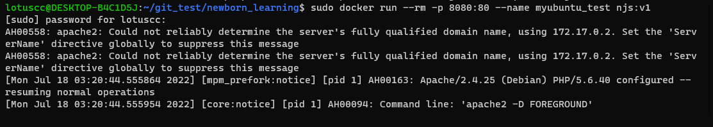
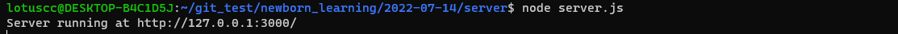
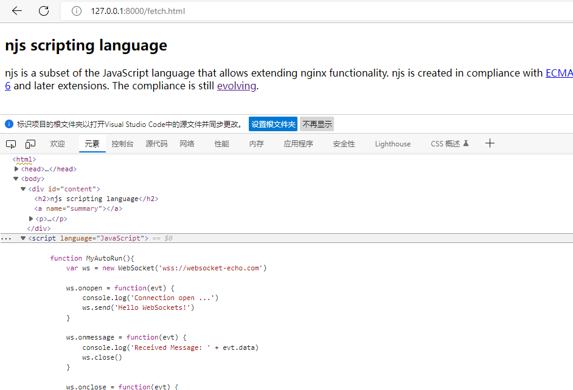
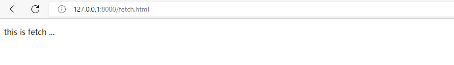
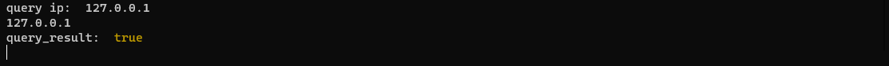

# newborn_learning

### 项目简介

#### 项目需求：

设计一个代理系统，根据客户端能否访问外网来判断是否允许客户端获取后端数据
如果客户端不能访问外网，则说明这个客户端处于安全的处境，则可以正常获取后端数据
如果客户端能访问外网，则说明这个客户端处于不安全的处境，则不可以正常获取后端数据

同时要求这个代理系统处于透明状态，即不能干扰客户端以及后端

由此提出两个子需求，如何判断客户端是否能访问外部网络
代理系统如何知晓客户端的网络情况


#### 结论：
通过配置Nginx代理以及一个相关验证服务器，使得Nginx代理可以根据验证服务器的信息来判断客户端的网络情况，最终决定是否转发数据，但是也存在缺陷，只能判断客户端HTTP层面的通信能力，无法判断TCP层面的通信能力。

同时由于浏览器本身采用的安全策略而导致的限制还有两点需要注意：
1. 浏览器阻止https请求的页面中再发起http请求
2. 对于跨域请求需要服务端设置Allow响应头字段以满足浏览器的安全策略

#### 具体实现：


系统的整体架构如图所示


1. Client客户端通过Nginx代理访问后端应用
2. Nginx代理收到请求后，先向Auth验证服务器发送**query**询问请求，询问该Client客户端IP是否通过验证
3. 如果验证成功Nginx代理将请求转到后端
4. 如果验证失败Nginx代理将后端数据添加一段自查代码 [isOutside.js](http://git.koal.com/zhangpengli/newborn_learning/-/blob/2022-07-14/2022-07-14/isOutside.js) 后返回给Client客户端
5. Client客户端收到的数据中如果有那段添加的代码，则会首先通过WebSockct测试本地能否访问外部网络，如果不能访问外部网络则向Auth验证服务器发送**register**注册请求

对于第一个子需求：如何判断客户端是否能访问外部网络

这里采用了传统的方法，客户端将向外发送一个websocket数据包，根据这个数据包的发送情况来判断是否具有访问外网的能力，这种方法也存在一定缺陷，由于websocket是基于HTTP的，发送websocket数据包失败不能代表完全没有外网访问能力，只能说明无法向外进行HTTP通信，对于TCP层的通信能力还是无法判断。

代理系统如何知晓客户端的网络情况

客户端根据数据包发送情况知晓外部通信能力以后，会将结果发送给验证服务器，验证服务器将结果保存起来，同时提供对外查询接口，Nginx代理根据接口来查询连接的每一个客户端的信息

验证服务器这里采用nodejs来实现，简单实现了两个接口，一个接口用于向服务器注册相关信息，一个接口用于查询相关信息

要求这个代理系统处于透明状态，所以客户端自查通信能力相关代码不能由后端来实现，而必须由Nginx代理来实现
具体方式为：对于客户端的每一次请求，将一段自查代码附加在请求数据后面，再发送给客户端，添加附加数据的操作采用NJS来实现


#### 实验测试：

准备好后端相关数据，配置好Docker相关内容，启动Docker
> sudo docker run --rm -p 8080:80 --name myubuntu_test njs:v1


启动Docker后相当于后端数据已准备好，此时通过8080应该能直接在浏览器中访问到后端数据

启动验证服务器
> node server.js



启动Nginx代理    
> sudo nginx -c lotuscc_nginx.conf 

Nginx代理启动后，可以通过代理配置端口8000访问相关数据

可以看到第一次访问数据时，返回数据中被Nginx代理添加了自查相关代码



客户端根据代码中数据包发送结果向验证服务器注册相关信息


由于这里可以访问外网，所以手动向验证服务器发送一条注册信息，以模拟不能访问外网的情况

```js
    var xhr = new XMLHttpRequest ();
    var url = 'http://127.0.0.1:3000/register';  
    xhr.open('GET', url, true);

    xhr.onreadystatechange = function () {
        if (xhr.readyState == 4 && xhr.status == 200) {
            console.log(xhr.responseText);
        }
    }
    xhr.send();
```
然后刷新一下页面，可以看到此时已经能够正确获取后端数据


从验证服务器的调试信息也可以看出，Nginx代理确实向其发送了一条查询请求，并且结果为true



#### 经验总结：    

对于一个完整的系统来说，可以先实现一个个小模块，最后拼接成整个模块

对于很多难以进行一步步调试的地方，可以采用一些外部方法来观察结果，例如对于网络来说，可以采用抓包的方法来观察网络的情况


